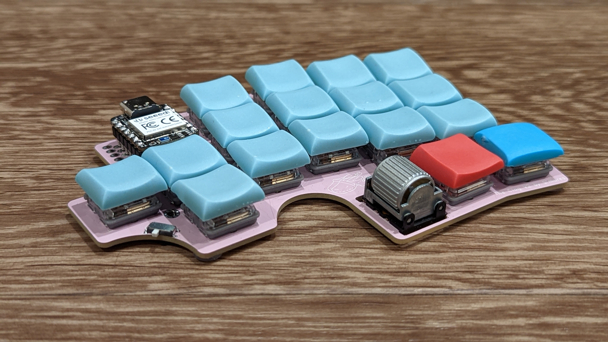
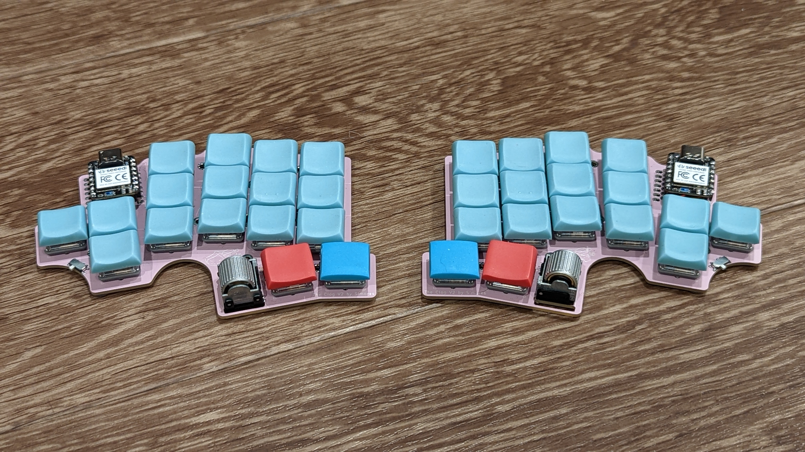
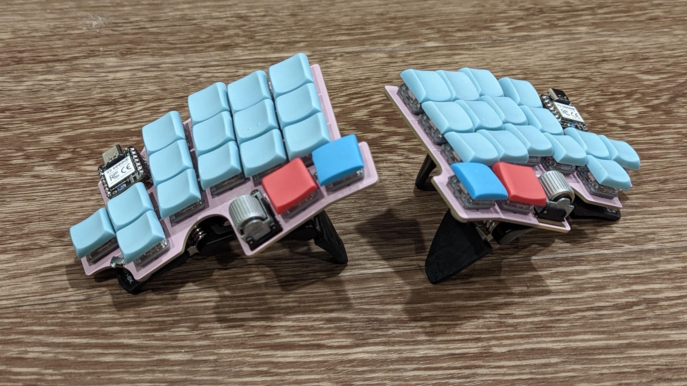
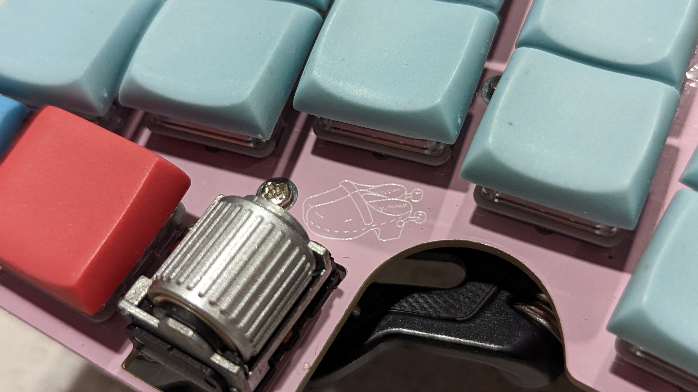

The Clog V2
===========

The Clog V2 is a 34-key split keyboard. It has the following features:

- Choc V1 switches
- Wireless only with Seeeduino Xiao BLE controllers
- Pinky clusters (top pinky keys on the sides)
- Splay (4° between middle and ring, 8° between ring and pinky)
- SplitKB puck support for tenting
- EVQWGD001 roller support

## How to Order

The [gerber ZIP](./clog-v2.zip) has everything you'll need to get this printed.
You can order from [JLC](https://jlcpcb.com) by just uploading that ZIP archive and keeping
the default options. I'd suggest removing the order number, otherwise they'll put
one on the board somewhere randomly.

## Building

### Parts Needed

Part Name            | Quantity        | Notes                                    | Link
--------------------:|:---------------:|:----------------------------------------:|:----
PCB                  | 2 (halves)      |                                          | Look up hurr hurr
Choc V1 Switches     | 34              |                                          | <https://mkultra.click/choc-switches>
Choc Keycaps         | 34              |                                          | <https://mkultra.click/mbk-factory-colors>
SMD Diodes           | 34              |                                          | <https://www.aliexpress.com/item/3256802562651339.html>
Power Switches       | 2               | Technically optional                     | <https://www.digikey.com/en/products/detail/nidec-copal-electronics/CUS-12TB/1124222>
Xiao BLE             | 2               | Not technically optional                 | <https://www.seeedstudio.com/Seeed-XIAO-BLE-nRF52840-p-5201.html>
Small LiPo Batteries | 2               |                                          | <https://www.aliexpress.com/item/2251832610867849.html>
Inch of Copper Wire  | 1               | Use thin and sheathed                    | Any hardware store
MCU Sockets          | 1 strip to chop | Optional, chop into sections of 7 pins   | <https://www.digikey.com/en/products/detail/mill-max-manufacturing-corp/316-43-164-41-006000/1212147>
MCU Socket Pins      | 28              | Optional, buy extras, these are slippery | <https://www.digikey.com/en/products/detail/mill-max-manufacturing-corp/3320-0-00-15-00-00-03-0/4147392>

### Tips

I'd solder the parts in this order:

- Diodes
- Power switches
- MCU sockets/Headers that came with the Xiao's
- MCU pins if you're [socketing](https://docs.splitkb.com/hc/en-us/articles/360011263059-How-do-I-socket-a-microcontroller-)
- Batteries (To the +ve and -ve terminals)
- The "bodge" wire from the +ve charging pad on the controller to the "Bdg" hole
- Choc switches

## Pictures

